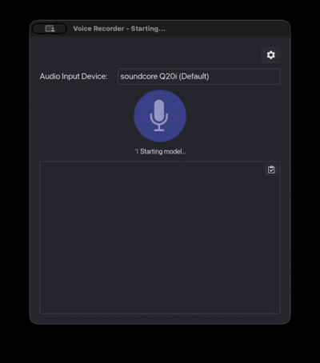

# Live Voice Transcribe
An [`iced`](https://crates.io/crates/iced) based GUI for [`parakeet-rs`](https://crates.io/crates/parakeet-rs).

## Getting Started
1. Download the [required model files](https://huggingface.co/altunenes/parakeet-rs/tree/main/nemotron-speech-streaming-en-0.6b) and place them in the root directory (**nemotron speech streaming** is used at the moment)
2. Build and run the project using `cargo run --release`
3. Wait for the model to load and then start the transcription with the 🎙️ button

### Demo


### Note for Mac Users with Intel Chip
You may need to install the *onnxruntime* manually (for example `brew install onnxruntime`) and link to it dynamically, because [`ort`](https://crates.io/crates/ort) does not offer pre-built binaries for this platform anymore. This can be done with the following `.cargo/config.toml`:
```toml
[env]
ORT_LIB_LOCATION = "/usr/local/opt/onnxruntime/lib"
ORT_PREFER_DYNAMIC_LINK = "1"
```

The library path may need to be adjusted.